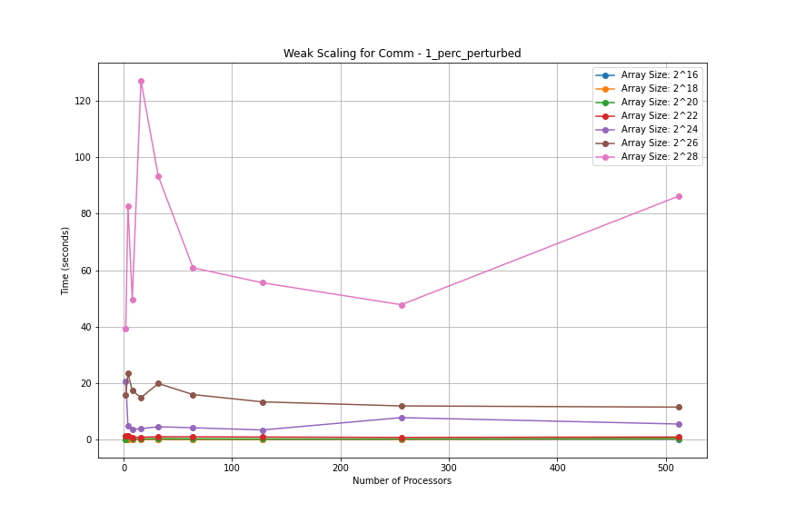
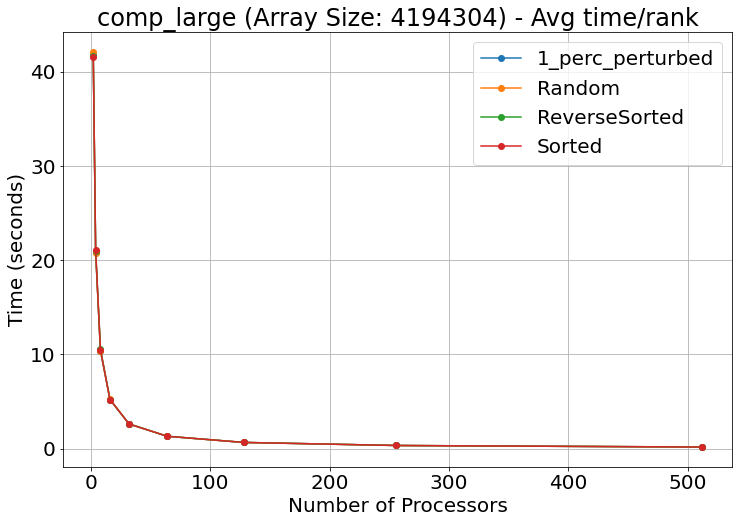
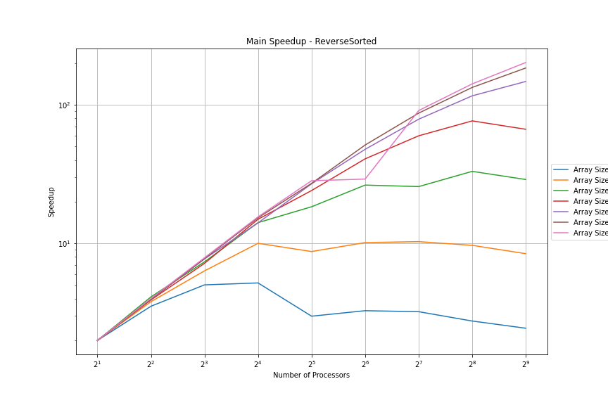
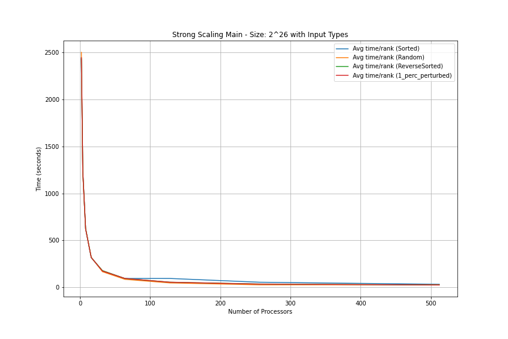

# CSCE 435 Group project

## 0. Group number: 4

## 1. Group members:
1. Eliseo Garza
2. Carlos Moreno
3. Daniela Martinez
4. Manuel Estrada

## 2. Project topic (e.g., parallel sorting algorithms)

### 2a. Brief project description (what algorithms will you be comparing and on what architectures)

- Bitonic Sort: Carlos Moreno
- Sample Sort: Daniela Martinez
- Merge Sort: Manuel Estrada
- Radix Sort: Eliseo Garza

### 2b. Pseudocode for each parallel algorithm
- For MPI programs, include MPI calls you will use to coordinate between processes

```
Radix Sort

(Sorting each element starting with LSD -> MSD)

Initialize MPI

Get ranks and determine # of processes and size of array (randomly generated or taken from another file)

Split up input array based on # of processes

Use MPI_Broadcast or MPI_Send to send necessary information to each process if needed

// Compute Radix Sort in each sub-array (via counting sort)
for each digit in element:
    Find digit frequency and store it in a histogram (in each process)
    Send histogram using MPI_Send or MPI_Reduce to main/root process
    Main/root process does calculations on resultant histogram
    Main/root process sends back new histogram to all processes using MPI_Scatter
    Each process adjusts data/number distributions accordingly

Once all processes are finished sorting their sub-arrays, combine/merge them in the main/root process

De-allocate/close MPI communicators and processes
```

```
Bitonic Sort

Helper functions:
compareAndSwap -
compare two indices within the given array and sort them based on the direction given (ascending or descending)

bitonicMerge -
if count > 1:
    calculate midpoint based on how many elements we are merging
    for each indice from the low point to mid point:
        use compareAndSwap on each of two points and give direction
    call bitonicMerge recursively twice

bitonicSort - 
    if count > 1:
        calculate midpoint based on number of elements we are sorting
        call bitonicSort recursively to sort first half into ascending order
        call bitonicSort recursively to sort first half into descending order
        call bitonicMerge and merge the results into either ascending or descending order based on what we want

Main - 
Initializae MPI

Get ranks and determine # of processes and size of array (randomly generated or taken from another file)

Split up input array based on # of processes

Use MPI_Scatter to distribute array across all processes

Sort using bitonicSort function

Use MPI_Gather to grab the sorted parts back to the root process

if root process:
    call bitonicMerge once everything has been gathered to create final array

call MPI_Finalize to finish up
```
```
Merge Sort

MergeSort(A, lower, upper)
    If lower < upper
        mid = [(lower+upper)/2]
        MergeSort(A, lower, upper)
        MergeSort(A, mid+1, upper)
        Merge(A, lower, mid, upper)

Merge(A, lower, mid, upper)
    n_1 = mid - lower + 1
    n_2 = upper - mid
    let left[1..n_1 + 1] and right[1..n_2 + 1] be new arrays
    for i = 1 to n_1
        left[i] = A[lower + i - 1]
    for j = 1 to n_2
        right[j] = A[mid + j]
    left[n_1 + 1] = infinity
    right[n_2 + 1] = infinity
    i = 1
    j = 1
    for k = lower to upper
        if left[i] <= right[j]
            A[k] = left[i]
            i = i + 1
        else A[k] = right[j]
            j = j + 1
Main:
Initialize MPI here (before the algorithms are run)
Make sure to use MPI Send as arrays are being split (or potentially also MPI Scatter). The root process distributes data, and other processes receive it.
Run Merge Sort
While mergesort is running, MPI Recv can be used (or also MPI Gather). The chunks are then by received.
Once the algorithm is finished, make sure to use MPI Finalize to close down everything
```

```
Sample Sort

Initialize MPI 
- Get ranks and determine # of processes and size of array (randomly generated or taken from another file)
- Assign a portion of the input data to each processor

Local sort each processors
Each processor will select equally spaced samples from its sorted local data
Gather all samples at the master process(MPI_Allgather)

The master process sorts the gathered samples and selects (p-1) global splitters
if rank == 0:
    sorted_samples = sort(all_samples)
    splitters = choose_splitters(sorted_samples, p-1)

Broadcast the splitters to all processes
MPI_Bcast(splitters, root=0)

Each processes partitions its local data into buckets based on the splitters
the processors then send the buckets to their corresponding processors
for i = 0 to p-1:
    send(buckets[i], to_process=i)
    receive(bucket_from_i, from_process=i)

Each processor concatenates the data it received from all other processors and then sorts them

Gather sorted data at Master

MPI_Finalize()

```
### 2c. Evaluation plan - what and how will you measure and compare
- We will first try our algorithms with input sizes of 2^16, 2^18, 2^20, 2^22, 2^24, 2^26, 2^28.
- We will then for each one try it with a version/type that is sorted, random, reverse sorted, and sorted with 1% perturbed.
- For each of the different input arrays, we will increase the processors from 2, 4, 8, 16, 32, 64, 128, 256, 512, 1024, and increase the number of nodes accordingly.
- We will then increase the number of processors from 2, 4, 8, 16, 32, 64, 128, 256, 512, and 1024 for when the input array size increases.

## 3. Team Communication
For this project, our team will communicate via Messages and Discord.

### 3a. Caliper Instrumentation
```
Bitonic Sort Calltree
0.460 main
└─ 0.454 main
   ├─ 0.403 comm
   │  ├─ 0.000 MPI_Init
   │  ├─ 0.036 MPI_Barrier
   │  ├─ 0.000 MPI_Finalize
   │  ├─ 0.000 MPI_Initialized
   │  ├─ 0.000 MPI_Finalized
   │  └─ 0.001 MPI_Comm_dup
   ├─ 0.001 data_init_runtime
   ├─ 0.050 comp_large
   │  ├─ 0.013 comm
   │  │  └─ 0.013 comm_large
   │  │     ├─ 0.001 MPI_Send
   │  │     └─ 0.011 MPI_Recv
   │  └─ 0.025 comp_large
   └─ 0.000 correctness_check
```
```
Merge Sort Calltree
12.539 main
    ├─ 0.014 data_init_runtime
    ├─ 0.436 comm
    │  └─ 0.434 comm_large
    │     ├─ 0.432 MPI_Scatter
    │     └─ 0.003 MPI_Gather
    ├─ 0.747 comp
    │  └─ 0.747 comp_large
    ├─ 0.007 correctness_check
    ├─ 0.000 MPI_Finalize
    ├─ 0.000 MPI_Initialized
    ├─ 0.000 MPI_Finalized
    └─ 11.333 MPI_Comm_dup
```
```
Sample Sort Calltree
1.069 main
├─ 0.000 MPI_Init
├─ 0.055 comp
│  ├─ 0.003 data_init
│  ├─ 0.022 local_sort
│  ├─ 0.000 select_samples
│  ├─ 0.000 choose_splitters
│  ├─ 0.011 partition_data
│  └─ 0.019 final_local_sort
├─ 0.017 comm
│  ├─ 0.006 gather_samples
│  │  └─ 0.006 MPI_Gather
│  ├─ 0.005 broadcast_splitters
│  │  └─ 0.005 MPI_Bcast
│  ├─ 0.002 send_recv_sizes
│  │  └─ 0.002 MPI_Alltoall
│  └─ 0.003 send_recv_buckets
│     └─ 0.002 MPI_Alltoallv
├─ 0.000 MPI_Finalize
├─ 0.000 MPI_Initialized
├─ 0.000 MPI_Finalized
└─ 0.022 MPI_Comm_dup
```
```
Radix Sort Calltree
23.560 main
├─ 0.024 data_init_runtime
├─ 21.451 comm
│  ├─ 4.207 comm_small
│  └─ 16.025 comm_large
├─ 0.005 comp
│  ├─ 0.001 comp_small
│  └─ 0.004 comp_large
└─ 0.130 correctness_check
```

### 3b. Collect Metadata
```
Bitonic Sort Metadata
profile	nid	spot.channel	Min time/rank	Max time/rank	Avg time/rank	Total time	Variance time/rank	Min time/rank (exc)	Max time/rank (exc)	Avg time/rank (exc)	Total time (exc)	Calls/rank (min)	Calls/rank (avg)	Calls/rank (max)	Calls/rank (total)	name	algorithm
node	num_procs	input_size																		
{'name': 'main', 'type': 'function'}	16	1048576	3982932162	1.0	regionprofile	0.457499	0.460546	0.459576	7.353210	0.000001	0.005166	0.005268	0.005196	0.083140	NaN	NaN	NaN	NaN	main	bitonic
1048576	3982932162	2.0	regionprofile	0.452231	0.455361	0.454379	7.270070	0.000001	0.000179	0.000947	0.000252	0.004035	NaN	NaN	NaN	NaN	main	bitonic
{'name': 'comm', 'type': 'function'}	16	1048576	3982932162	3.0	regionprofile	0.400463	0.409566	0.402898	6.446360	0.000004	0.361970	0.375348	0.366079	5.857256	3.0	3.0	3.0	48.0	comm	bitonic
{'name': 'MPI_Init', 'type': 'function'}	16	1048576	3982932162	4.0	regionprofile	0.000027	0.000052	0.000036	0.000578	0.000000	0.000027	0.000052	0.000036	0.000578	1.0	1.0	1.0	16.0	MPI_Init	bitonic
{'name': 'MPI_Barrier', 'type': 'function'}	16	1048576	3982932162	6.0	regionprofile	0.027029	0.039529	0.035856	0.573696	0.000013	0.027029	0.039529	0.035856	0.573696	2.0	2.0	2.0	32.0	MPI_Barrier	bitonic
    ```
    ```
    cali.caliper.version  mpi.world.size  \
    profile                                           
    4252203976               2.11.0              32   

                                                 spot.metrics  \
    profile                                                         
    4252203976  min#inclusive#sum#time.duration,max#inclusive#...   

           spot.timeseries.metrics  spot.format.version  \
    profile                                                   
    4252203976                                            2   

                                                 spot.options  spot.channels  \
    profile                                                                        
    4252203976  time.variance,profile.mpi,node.order,region.co...  regionprofile   

           cali.channel spot:node.order         spot:output spot:profile.mpi  \
    profile                                                                        
    4252203976         spot            true  p32-a16777216.cali             true   

           spot:region.count spot:time.exclusive spot:time.variance  \
    profile                                                               
    4252203976              true                true               true   

            launchdate                                          libraries  \
    profile                                                                     
    4252203976  1729130109  [/scratch/group/csce435-f24/Caliper/caliper/li...   

                            cmdline cluster algorithm programming_model  \
    profile                                                                   
    4252203976  [./mergesort, 16777216]       c     merge               mpi   

           data_type  size_of_data_type  input_size input_type  num_procs  \
    profile                                                                     
    4252203976       int                  4    16777216     Random         32   

           scalability  group_num  \
    profile                             
    4252203976      strong          4   

                                        implementation_source  
    profile                                                        
    4252203976  ai and online: https://www.christianbaun.de/CG...  
    ```

```
Sample Sort

    	nid	spot.channel	Min time/rank	Max time/rank	Avg time/rank	Total time	Variance time/rank	Min time/rank (exc)	Max time/rank (exc)	Avg time/rank (exc)	Total time (exc)	Calls/rank (min)	Calls/rank (avg)	Calls/rank (max)	Calls/rank (total)	name	num_procs
node	profile																	
{'name': 'main', 'type': 'function'}	2092793214	1.0	regionprofile	1.069346	1.069460	1.069425	17.110803	0.000000	0.976217	0.976878	0.976332	15.621311	NaN	NaN	NaN	NaN	main	16
{'name': 'MPI_Init', 'type': 'function'}	2092793214	2.0	regionprofile	0.000030	0.000134	0.000108	0.001732	0.000000	0.000030	0.000134	0.000108	0.001732	1.0	1.0	1.0	16.0	MPI_Init	16
{'name': 'comp', 'type': 'function'}	2092793214	3.0	regionprofile	0.035956	0.075938	0.054651	0.874419	0.000051	0.000060	0.000074	0.000066	0.001049	6.0	6.0	6.0	96.0	comp	16
{'name': 'data_init', 'type': 'function'}	2092793214	4.0	regionprofile	0.002546	0.002581	0.002556	0.040900	0.000000	0.002546	0.002581	0.002556	0.040900	1.0	1.0	1.0	16.0	data_init	16
{'name': 'local_sort', 'type': 'function'}	2092793214	5.0	regionprofile	0.022239	0.022707	0.022332	0.357317	0.000000	0.022239	0.022707	0.022332	0.357317	1.0	1.0	1.0	16.0	local_sort	16


```

Radix Sort Metadata:
cali.caliper.version	mpi.world.size	spot.metrics	spot.timeseries.metrics	spot.format.version	spot.options	spot.channels	cali.channel	spot:node.order	spot:output	spot:region.count	spot:time.exclusive	launchdate	libraries	cmdline	cluster	algorithm	programming_model	data_type	size_of_data_type	input_size	input_type	num_procs	scalability	group_num	implementation_source
profile																										
3307806477	2.11.0	32	min#inclusive#sum#time.duration,max#inclusive#...		2	node.order,region.count,time.exclusive	regionprofile	spot	true	32-1048576.cali	true	true	1729135233	[/scratch/group/csce435-f24/Caliper/caliper/li...	[./radix_sort, 1048576]	c	radix	mpi	int	4 bytes	1048576	random	32	strong	4	online

```
### 4. Performance Evaluation
```
Bitonic Sort
```


Looking at the following images, we can see that for the 2^24 input, the perturbed did not run on the 1024 processor, which can be attribtued to a grace issue. The same thing is for the sorted input on the 2^24 size array, where the 512 and 1024 processor did not run either. This can also be attributed to grace issues, which have been prevalent. The same issue occured on the 2^16 graph, where the reverse 1024 processor job did not run, also due to grace issues.

We can see that for bitonic sort, as we increase the number of processors the communication runtime increases, while the computation time decreases. Despite this, we can see that the overall main function runtime still increases as you add more processors, indicating that this implementation does not scale well. This is also evident in the speedup graph, where for most of the sizes, the lines trend downwards and become consistent, with the only exception being the largest input size which has an increase in speedup as more processors are added. Overall, it's safe to say that this implementation of bitonic sort does not do well in comparison with the other algorithms in terms of speedup, as it is not as consistent compared to the other implementations like sample or radix sort.

--------------------------------------------------

```
Radix Sort:
```





--------------------------------------------------

The first graph shows all array input sizes with respect to the number of processes they were run on for weak scaling for comm.  The communication performance seemed to stay roughly equal for most processors and input sizes, but there did seem to be spikes for the 1%perturbed array which is shown here. I hypothesize that this is due to extra communication required randomly between the different processes, or the way that I created the 1%perturbed array as it was significantly different than the others. Additionally, as the array size increased, the communication time increased with it, with the biggest impact shown during the 2^28 array.

The second graph shows the avg time/rank it took for the **comp_large** section during an array of size 2^22. For the computation performance, there seemed to be a steady decrease as we increased processors. I estimate it to be about a 75% decrease from one input size to the next. With the increase in input size by 2^2, being 4x, each array size increase the avg time/rank by about 4x. It is important to note, however, that this is the **avg time/rank** from comp_large. This means that all it's the average time spent per processor on computations done. If we were to add this up between all the processes, we would see that the total time would be a lot larger.

--------------------------------------------------





--------------------------------------------------

The graphs above show main in more detail. The top graph shows the speedup of main, while the bottom one shows the scaling of main for the array size 2^26. In the top graph, we can see there are several lines, each representing a different array input size, with the input type here being Reverse Sorted. This specific graph shows the speedup in relation to T(1), depicting the overall speedup as the number of processors increase. From the graph it can be concluded that as the number of processors increase, and as the array size increases, the speedup largely increases as a byproduct.

The second graph shows an array of size 2^26 with each line representing an input type, helping gain a better understanding on how the input types may impact overall main runtime. From this graph, the big takeaway is that the overall main time decreases drastically as the number of processes increases, with little variance coming from the type of input.

Something to note is that the algorithm was unable to run for 1024 processors, and as such I was unable to gather caliper files and subsequent graphs with 1024 data points. I believe this was due to memory or scaling limitations associated with the large number of processors.

In conclusion, Radix Sort seems to run best when both the array size and number of processors are increased. Generally, the larger the array and the more processors, the better for this algorithm. Radix Sort doesn't perform well with few processors and/or a small array as it can't take full advantage of the parallelism offered by the algorithm.

--------------------------------------------------

```
Merge Sort
```

Unfortunately, due to issues regarding jobs being stuck in queue, graphs were not able to be produced for the caliper files calculated for the analysis portion of the project. However, caliper all caliper files implementations combinations, besides processors of 1024, have been created and do exist for the implementation of merge sort. These graphs and proper analysis will be included for the presentation.

--------------------------------------------------

```
Sample Sort
```


The following graphs display the performance of the Sample Sort algorithm across various input sizes and processor counts. However, it should be noted that the algorithm failed to execute correctly for configurations involving 512 and 1024 processors. This issue was likely caused by scaling limitations or communication overheads at those higher processor counts.

From the analysis of the graphs, one key observation is that Sample Sort performs better as the input array size increases. For smaller arrays, there were more performance outliers, indicating variability in the execution times across different processor configurations. However, with larger arrays—specifically those with sizes of 2^24, 2^26, and 2^28 the algorithm demonstrated more consistent performance, with fewer outliers and better scalability.

This suggests that Sample Sort is more effective at handling larger datasets, where the overhead of dividing and distributing the workload across processors is balanced by the increased computation. The larger arrays allow the algorithm to fully utilize the available processors, leading to more efficient parallelization and reduced time per processor.

In conclusion, while Sample Sort struggles with higher processor counts for smaller arrays, it excels with larger input sizes, demonstrating improved performance and scalability as the problem size grows.

--------------------------------------------------
